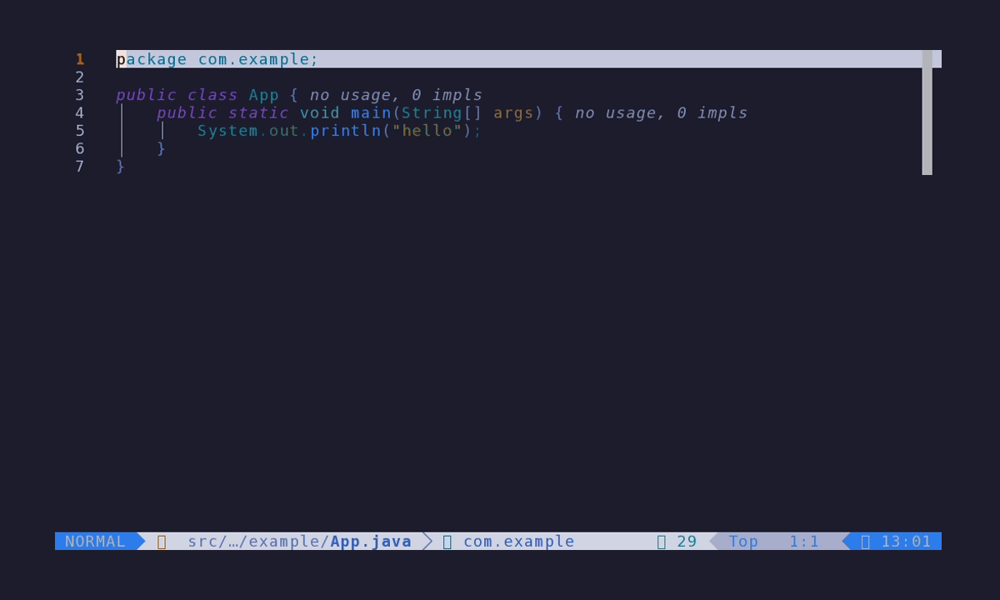
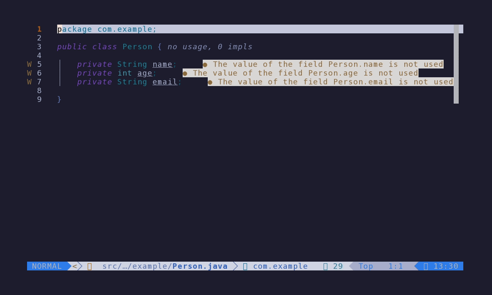

# jc.nvim

**A Java productivity layer for Neovim, on top of an externally managed
[jdtls](https://github.com/eclipse/eclipse.jdt.ls).**

jc.nvim never starts or installs the language server. You run jdtls with
[nvim-java](https://github.com/nvim-java/nvim-java),
[nvim-jdtls](https://github.com/mfussenegger/nvim-jdtls) or nvim-lspconfig, and
jc.nvim hooks into whatever `jdtls` client attaches and adds code generation,
class creation, a test runner, a build-tool runner, refactorings, debugging and
more — the ergonomics of [vim-javacomplete2](https://github.com/artur-shaik/vim-javacomplete2)
(its predecessor), rebuilt on Neovim's built-in LSP client. There's a
[blog post](https://shaik.link/posts/javacomplete-to-jc.nvim/) on the why.

## Demo

Creating classes from the one-line DSL — an interface, an enum with constants
and an exception (template + `extends` + generated body):

<!-- Record with `vhs docs/class-creation.tape` (see docs/README.md) -->


Generating a constructor and `toString` — the picker windows let you choose
fields and the generation style:

<!-- Record with `vhs docs/code-generation.tape` -->


## Features

- **Code generation** — `toString`, `hashCode`/`equals`, constructors,
  accessors, all with interactive field selection; add unimplemented
  (abstract) methods.
- **Organize imports** — a smart mode that remembers your preferred class per
  ambiguous name, per project; replace an import by picking among same-named
  types.
- **Class creation** — a one-line DSL (or a step-by-step wizard) with `<Tab>`
  completion, project-aware package/module resolution and a library of
  templates (records, spring stereotypes, JPA entity, JUnit, …).
- **Test runner** — run JUnit tests through
  [neotest](https://github.com/nvim-neotest/neotest) with the classpath
  resolved from jdtls; optional.
- **Build runner** — run gradle/maven tasks with a module + task picker;
  compile errors go to the quickfix list.
- **Refactorings** — extract variable / method, convert to static import.
- **Debugging** — attach/launch via
  [nvim-dap](https://github.com/mfussenegger/nvim-dap) or
  [vimspector](https://github.com/puremourning/vimspector), with per-project
  host/port memory.
- **Navigation** — jump between a class and its test; go to a file by its
  fully-qualified name (an FQN-aware `gf`).
- **Utilities** — classpath-aware `javap` / `jshell` / `jol`; decompiled
  `jdt://` class view; wipe a corrupted jdtls workspace.

## Requirements

- Neovim ≥ 0.10 (0.11+ recommended).
- A running `jdtls` from nvim-java, nvim-jdtls or lspconfig, started with
  `extendedClientCapabilities` (notably `executeClientCommandSupport` and
  `advancedOrganizeImportsSupport`) — nvim-java and nvim-jdtls do this out of
  the box.
- Optional, per feature:
  - **debug** — the [java-debug](https://github.com/microsoft/java-debug)
    bundle in jdtls (nvim-java bundles it; nvim-jdtls: add it to
    `init_options.bundles`) and nvim-dap or vimspector.
  - **test runner** — [neotest](https://github.com/nvim-neotest/neotest) (see
    [Test runner](#test-runner)).
  - `:JCutilJol` downloads the jol-cli jar into `~/.m2` on first use.

## Installation

<details open>
<summary>lazy.nvim, jdtls managed by nvim-java (recommended)</summary>

```lua
return {
  "artur-shaik/jc.nvim",
  ft = { "java" },
  dependencies = { "nvim-java/nvim-java" },
  opts = {
    keys_prefix = "<leader>j",
  },
}
```
</details>

<details>
<summary>With the optional test runner (neotest)</summary>

```lua
{
  "artur-shaik/jc.nvim",
  ft = { "java" },
  dependencies = {
    "nvim-java/nvim-java",
    {
      "nvim-neotest/neotest",
      optional = true,
      dependencies = { "nvim-neotest/nvim-nio", "nvim-lua/plenary.nvim" },
      opts = function(_, opts)
        opts.adapters = opts.adapters or {}
        table.insert(opts.adapters, require("jc").neotest_adapter())
        -- optional: auto-close the summary on an all-green focused run
        opts.consumers = opts.consumers or {}
        opts.consumers.jc = require("jc").neotest_consumer()
      end,
    },
  },
  opts = { keys_prefix = "<leader>j" },
}
```
</details>

jc.nvim works with any owner of the `jdtls` client — nvim-jdtls or a plain
lspconfig setup are fine too; just drop `nvim-java` from `dependencies` and
start jdtls your own way.

If `setup` is never called, opening a java file initializes the plugin with
defaults.

## Configuration

All options go through `setup(opts)` (or your plugin manager's `opts`):

```lua
require("jc").setup({
  keys_prefix = "<leader>j",        -- prefix for the default mappings
  default_mappings = true,          -- install default mappings on attach
  autoformat_on_save = false,       -- format java buffers on save
  debug_backend = nil,              -- "dap" | "vimspector" | nil (auto-detect)
  basedir = nil,                    -- data dir, default ~/.local/share/jc.nvim
  update_config_on_new_file = true, -- refresh jdtls build path on new java files
  templates_dir = nil,              -- dir of user class templates
  class_type_exclude = nil,         -- package prefixes hidden from type completion
  class_prompt = "oneline",         -- "oneline" (DSL) | "wizard" (step-by-step)
  map_gf = true,                    -- override gf with an FQN-aware go-to-file
  on_attach = nil,                  -- function(client, bufnr) extra hook
  test = {                          -- test runner (see Test runner)
    precompile = false,             -- compile with gradle/maven before a run
    notify = true,                  -- toast run start / result
    open_summary = true,            -- open the neotest summary on a run
    autoclose_summary = true,       -- close it after an all-green focused run
    console_launcher_path = nil,    -- path to the JUnit console-standalone jar
  },
})
```

<details>
<summary><code>class_prompt = "wizard"</code></summary>

Swaps the one-line DSL prompt for a step-by-step `vim.ui.select`/`vim.ui.input`
flow (template → module → package → name → extends/implements/fields/flags).
Each step is a short clean list, which avoids the cmdline-completion truncation
of very long package paths. The mapping `<p>N` always runs the wizard,
regardless of this option.
</details>

<details>
<summary><code>class_type_exclude</code></summary>

Adds package prefixes to hide from the `extends`/`implements`/field-type
completion. The prompt resolves types from jdtls' workspace symbols, which
include non-importable ones; nested classes, shaded jars, `internal`/`impl`
packages and a built-in list of known JDK/library internals (`sun.*`,
`com.sun.*`, `jdk.internal`, jackson `introspect`/`cfg`/…) are dropped
automatically. The LSP gives no visibility, so package-private classes in
ordinary packages can still slip through — add their prefixes here, e.g.
`{ "com.example.somelib.internalish" }`.
</details>

<details>
<summary><code>update_config_on_new_file</code></summary>

A java file created in-editor isn't on jdtls' build path until the project
configuration is refreshed, so go-to-definition returns nothing on it (while
find-references still works off the search index). With this on (default), jc
detects such files and fires `:JCutilUpdateConfig` on their first write. Set it
to `false` to refresh manually.
</details>

<details>
<summary>Legacy globals</summary>

`g:jc_default_mappings`, `g:jc_autoformat_on_save`, `g:jc_debug_backend` and
`g:jc_basedir` still work as a fallback when the corresponding option isn't
passed to `setup`.
</details>

## Commands

`:checkhealth jc` verifies the setup; `:help jc` has the full reference.

**Imports & code generation**

| Command | Action |
|---|---|
| `JCimportsOrganizeSmart` | organize imports, auto-picking remembered classes |
| `JCimportsOrganize` | organize imports, choosing from the candidate list |
| `JCimportsReplace` | replace the import of the type under the cursor (pick among same-named, e.g. `lombok.Value` vs spring's) |
| `JCgenerateToString` | generate `toString()` with field selection |
| `JCgenerateHashCodeAndEquals` | generate `hashCode()` and `equals()` |
| `JCgenerateAccessors` | choose fields for accessor generation |
| `JCgenerateAccessorGetter` / `…Setter` / `…SetterGetter` | getter / setter / both for a field |
| `JCgenerateConstructor` | choose fields for a constructor |
| `JCgenerateConstructorDefault` | no-arg constructor |
| `JCgenerateAbstractMethods` | add unimplemented methods |

**Class creation & navigation**

| Command | Action |
|---|---|
| `JCgenerateClass` | class creation prompt (DSL or wizard per `class_prompt`) |
| `JCgotoTest` | jump to the test class (or back), creating it if missing |
| `JCgotoFqn` | open the java file for the FQN under the cursor |

**Refactor**

| Command | Action |
|---|---|
| `JCrefactorExtractVar` | extract variable (all occurrences) |
| `JCrefactorExtractMethod` | extract method (visual range) |
| `JCrefactorStaticImport` | convert the call at the cursor to a static import |
| `JCrefactorStaticImportEnum` | static-import every constant of the enum |

**Test runner**

| Command | Action |
|---|---|
| `JCtestRun` | run the test at the cursor |
| `JCtestFile` | run every test in the current file |
| `JCtestSuite` | run every test under the project root |
| `JCtestPick` | pick a test class from the whole project and run it |
| `JCtestLast` | re-run the last test position |
| `JCtestStop` | stop the running test |
| `JCtestSummary` / `JCtestOutput` | toggle summary / open the test's output |
| `JCtestPrecompile` | toggle build-tool precompile before a run |
| `JCtestInstall` | download the JUnit console launcher via maven |

**Build runner**

| Command | Action |
|---|---|
| `JCbuildRun [args]` | run gradle/maven with args (or prompt, defaulting to the last run) |
| `JCbuildTask` | pick a module then a task/goal |
| `JCbuildLast` | repeat the last build task |

**Debug & utilities**

| Command | Action |
|---|---|
| `JCdebugAttach` / `JCdebugLaunch` | attach / launch the debugger |
| `JCdapAttach` / `JCvimspectorAttach` | attach with a specific backend |
| `JCdebugWithConfig` | start with a chosen vimspector configuration |
| `JCtoggleAutoformat` | toggle format-on-save |
| `JCutilUpdateConfig` | re-read the project configuration (pom/gradle) |
| `JCutilWipeWorkspace` | delete the jdtls workspace and restart (works even if jdtls failed to start) |
| `JCutilJshell` | java shell with the project classpath |
| `JCutilBytecode` | bytecode of the current class (javap) |
| `JCutilJol` | object layout (jol) |

## Mappings

Installed on jdtls attach when `default_mappings` is enabled. `<p>` is
`keys_prefix` (default `<leader>j`).

| Mode | Keys | Action |
|---|---|---|
| n | `<p>i` / `<p>I` | organize imports — smart / manual |
| i | `<C-j>i` | organize imports |
| n | `<p>ts` | `toString()` |
| n | `<p>eq` | `hashCode()` and `equals()` |
| n | `<p>A` | accessors (field selection) |
| n | `<p>s` / `<p>g` / `<leader>ja` | setter / getter / both |
| i | `<C-j>s` / `<C-j>g` / `<C-j>a` | accessor generation |
| n | `<p>c` / `<p>cc` | constructor (fields) / default constructor |
| n | `<p>m`, i `<C-j>m` | abstract methods |
| n | `<p>n` / `<p>N` | new class — prompt / wizard |
| n | `<p>t` | jump to the test class (or back) |
| n | `gf` | go to file, or the java file of the FQN under the cursor |
| n | `<p>Tr` / `<p>Tf` / `<p>Ta` / `<p>Tl` | run test at cursor / file / all / last |
| n | `<p>Tp` | pick a test class from the project and run it |
| n | `<p>Ts` / `<p>To` | toggle test summary / open test output |
| n | `<p>b` / `<p>B` | run gradle/maven (prompt) / pick a task |
| n | `<p>da` / `<p>dl` | debug attach / launch |
| v | `<p>re` / `<p>rm` | extract variable / method (selection) |
| n | `<p>re` | extract variable, all occurrences (at cursor) |
| n | `<p>rs` / `<p>rS` | static import — call / every enum constant |
| n | `<p>rp` | replace the import of the type under the cursor |

## Class creation

The one-line DSL:

```
template:[subdir]:/package.ClassName extends Super implements If(String s, public Integer i):constructor:toString:equals
```

| Slot | Meaning |
|---|---|
| `template:` | *(optional)* a template name — `junit5`, `record`, `entity`, `service`, … |
| `[subdir]:` | *(optional)* a source-set or subproject — see below |
| `/package.Name` | class name and package (leading `/` = absolute; without it, relative to the current file's package) |
| `extends`/`implements` | *(optional)* supertypes, imported automatically |
| `(fields)` | *(optional)* `private` by default; for `enum` this slot lists the constants (`enum:/p.Day(MON, TUE)`) |
| `:flags` | *(optional)* `constructor`, `toString`, `hashCode`, `equals` |

**`[subdir]`** is a source-set or a subproject:

- a source-set name places the class in the current module's `src/<name>/java`
  — `[test]` mirrors the package into `src/test/java`;
- a subproject name (multi-module) targets that module directly —
  `[core]` or `[core/test]` for its test sources.

**Absolute package into another module.** Completion offers packages from every
subproject; if you pick a package that lives in another module, jc asks which
module to create the class in (current vs the one that already has the package).
A brand-new package is created in the current module.

**`<Tab>` completion** follows the scheme: templates and project packages for
the path, `[subdir]` after a template, the method flags once the class path is
given, and — after `extends `/`implements ` — class/interface names resolved
live from jdtls.

## Templates

Built-in: `class`, `interface`, `enum`, `record`, `annotation`, `exception`,
`main`, `singleton`, `servlet`, `junit`, `junit5`, `entity`, `service`,
`component`, `repository`, `controller` and the `android_*` family.

The `entity` template carries `@Entity` and an `@Id` id, and annotates each
prompt field with `@Column(name = "<snake_case>")`. Imports are left to
organize-imports (run automatically after creation), so it works whether your
project uses `jakarta.*` or `javax.*`.

### Custom templates

Point `templates_dir` at a folder of `<name>.lua` files. Each returns **either**
a declarative spec table (recommended — describe only the essence, the engine
builds the rest) **or** a `function(opts) -> string` for full control.

A Lombok DTO is just imports + an annotation, no skeleton to repeat:

```lua
-- ~/.config/nvim/jc-templates/dto.lua
return {
  imports = { "lombok.Data" },
  annotations = { "@Data" },
}
```

`dto:/com.app.User(String name, int age)` then produces a `@Data` class with the
package, declaration and fields filled in.

Spec fields (all optional): `kind` (`class`/`interface`/`enum`/`annotation`/
`record`), `modifiers`, `extends`, `implements`, `imports`, `annotations`,
`body`, `pre_fields` (members before the prompt fields), `field_annotation`
(`function(field) -> string`). `imports`/`annotations`/`body` may each be a
string, a list or a `function(opts)`. User input for `extends`/`implements`
overrides the spec defaults. `opts`: `name`, `package`, `fields`
(`{ mod, type, name }`), `extends`, `implements`.

## Test runner

jc.nvim ships a [neotest](https://github.com/nvim-neotest/neotest) adapter.
**neotest is an optional dependency** — without it the plugin works as before
and the `JCtest*` commands warn instead of erroring. Unlike the gradle/maven
adapters, this one resolves the test classpath straight from jdtls and runs the
[JUnit Platform Console Standalone](https://junit.org/junit5/docs/current/user-guide/#running-tests-console-launcher)
launcher, so there's no build-tool daemon to wait for and gradle/maven/plain
layouts all work the same way. Wire it as in
[Installation](#installation).

The launcher jar is looked up in `~/.m2`; if missing, run `:JCtestInstall` once
(downloads `org.junit.platform:junit-platform-console-standalone` via maven) or
set `test.console_launcher_path`.

Run tests with `:JCtestRun` (cursor), `:JCtestFile`, `:JCtestSuite`,
`:JCtestPick`, `:JCtestLast`, or the `<p>T*` mappings; neotest paints the gutter
green/red and a failed test's diagnostic points at the failing line. Runs open
the summary panel and, via the optional `jc` consumer, auto-close it after an
all-green **focused** run (cursor/file/class) — runs with failures stay open.
`JCtestRun`/`JCtestFile` also work from a production class: they run its paired
`<Class>Test` (the same counterpart `JCgotoTest` uses) when it exists.

The adapter toasts `running…` at the start and `N passed, M failed, K skipped`
at the end. Knobs: `test.notify`, `test.open_summary`, `test.autoclose_summary`
(`false`, or a delay in ms).

<details>
<summary>Classpath, JDK selection and freshness</summary>

The classpath is built from jdtls and augmented for correctness:

- **test + runtime scopes are unioned** — jdtls' `test` scope omits
  `runtimeOnly` dependencies ByteBuddy/Mockito need at run time (otherwise
  "green from the CLI but `NoClassDefFoundError` here").
- By default (`precompile = false`) jc forces a jdtls compile
  (`java/buildWorkspace`), uses jdtls' `bin` output first and the gradle/maven
  `build/`-`target/` dirs as a fallback. Fast, and fine when jdtls compiles the
  whole project.
- Some projects have classes jdtls won't put in `bin` (e.g. certain spring-data
  repositories) — the run then fails with `ClassNotFoundException` for a class
  that exists in the build output. Set `test.precompile = true` (or toggle with
  `:JCtestPrecompile`): jc runs `gradle :<module>:testClasses` /
  `mvn test-compile` first and uses the complete `build/`-`target/` output. The
  compile is async (editor stays responsive, progress in the cmdline), cached
  per module for the run, and on failure the javac/maven errors go to the
  quickfix list instead of running the tests.
- The run JVM is the configured `java.configuration.runtimes` entry matching the
  **highest** bytecode version among the module's classes (a 17-compiled test
  over an 11-target main still runs on 17, as gradle does), falling back to
  `resolveJavaExecutable` then PATH `java`.

If jdtls keeps dropping classes from `bin`, a `:JCutilWipeWorkspace` + restart
(clean re-import) often makes `bin` complete again, keeping you on the fast
`precompile = false` path.

On a **multi-module** project `:JCtestSuite` is best-effort: neotest reruns
`update_running` over the shared tree per sub-run, which can reset an
already-failed class back to running in the summary. Iterate with the focused
`:JCtestRun`/`:JCtestFile`, which run as a single neotest run and report
reliably.
</details>

## Build runner

Run gradle/maven tasks from the editor, in a dedicated split (`q` closes it);
compile errors are parsed into the quickfix list.

- `:JCbuildRun [args]` — run with the given args, or prompt (defaulting to the
  last run, remembered per project). Wide pty so long `file:line:` errors aren't
  wrapped.
- `:JCbuildTask` — pick a module (or the whole project), then a task: gradle
  tasks from `gradlew tasks`, or for maven the lifecycle phases, pom
  profiles/plugin goals and a plugin drill-down (`mvn help:describe` lists every
  goal of the chosen plugin). The module scopes the run (gradle `:module:task`,
  maven `-pl module -am`).
- `:JCbuildLast` — repeat the last task.

Commands run from the **reactor root** (outermost contiguous pom /
settings.gradle), so multi-module builds resolve paths and the reactor
correctly.

## Go to file by FQN

`JCgotoFqn` (and the overridden `gf`) opens the java source for a
fully-qualified name under the cursor — for jumping out of a terminal, a neotest
output window or a pasted stack trace into the code. It understands:

- a bare FQN `com.foo.Bar` (and `com.foo.Bar$Inner` → the outer file);
- an FQN with a member `com.foo.Bar.method` → the `Bar` file;
- a line suffix `com.foo.Bar:42`;
- a stack frame `at com.foo.Bar.method(Bar.java:25)` → `Bar`, line 25 (rejoined
  even when a narrow terminal wrapped it across two lines).

The file opens in the **last window that showed a java buffer** (so you can
trigger it from a terminal split and land back in your editing window), or a new
tab when there is none. The FQN is resolved through jdtls' symbol index (works
from any buffer) with a source-tree fallback.

When `default_mappings` is on, `gf` is overridden globally and falls back to the
builtin `gf` when the token isn't an FQN (e.g. a real path). Disable with
`setup{ map_gf = false }`.

## Debugging

`JCdebugAttach` / `JCdebugLaunch` route to a backend:

1. the `debug_backend` option / `g:jc_debug_backend` if set (`"dap"` or
   `"vimspector"`);
2. auto: nvim-dap installed and vimspector absent → dap;
3. fallback: vimspector.

Attach asks for host and port, remembered per project. The adapter port is
resolved from jdtls via `vscode.java.startDebugSession`, which needs the
java-debug bundle.

## What it adds over plain nvim-jdtls

| Feature | nvim-jdtls | jc.nvim |
|---|---|---|
| Code generation | via code actions | dedicated commands/mappings with field selection |
| Organize imports | code action | smart mode remembering preferred classes per project |
| Class creation | — | DSL prompt / wizard with templates |
| Test runner | — | neotest adapter, classpath from jdtls |
| Build runner | — | gradle/maven task picker → quickfix |
| Debug attach | manual dap config | `JCdebugAttach` with per-project host/port memory |
| javap/jshell/jol | yes | classpath-aware, built-in |

## Troubleshooting

- Run `:checkhealth jc` — it verifies the Neovim version, the attached jdtls
  client, organize-imports and java-debug availability, the debug backends,
  classpath resolution and neotest/launcher for the test runner, the jol jar,
  the treesitter java parser and the data dir.
- **Go-to-definition returns nothing on a just-created file** — it isn't on the
  build path yet; `update_config_on_new_file` handles this on first write, or
  run `:JCutilUpdateConfig`.
- **jdtls state looks corrupted / won't start** — `:JCutilWipeWorkspace`
  deletes the eclipse index and restarts (works even with no client attached).
- **Tests fail with `ClassNotFoundException`** for classes that exist — enable
  `test.precompile` (see [Test runner](#test-runner)).
